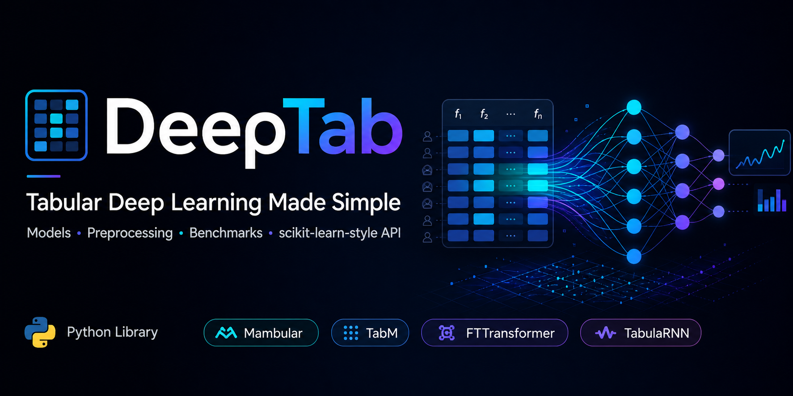

<div align="center">
    

[](https://pypi.org/project/deeptab)

[](https://pypi.org/project/deeptab)
[](https://github.com/OpenTabular/DeepTab/blob/main/LICENSE)
[](https://deeptab.readthedocs.io/en/latest/?badge=latest)
[](https://deeptab.readthedocs.io/en/latest/)
[](https://github.com/OpenTabular/DeepTab/issues)

[📘 Documentation](https://deeptab.readthedocs.io) |
[🚀 Getting Started](https://deeptab.readthedocs.io/en/latest/getting_started/quickstart.html) |
[🎯 Model Zoo](https://deeptab.readthedocs.io/en/latest/model_zoo/index.html) |
[📖 Tutorials](https://deeptab.readthedocs.io/en/latest/tutorials/index.html) |
[🤔 Report Issues](https://github.com/OpenTabular/DeepTab/issues)

</div>

# DeepTab: Tabular Deep Learning Made Simple

**DeepTab** is a Python library for deep learning on tabular data. It brings state-of-the-art architectures, State Space Models (Mamba), Transformers, and tree-inspired networks, to a single scikit-learn compatible interface, so you can go from a DataFrame to a trained model in a few lines.

## 📖 Why DeepTab?

- **Familiar interface.** A scikit-learn `fit`/`predict`/`evaluate` API that drops into existing pipelines, including `GridSearchCV`.
- **Automatic preprocessing.** Feature-type detection, encoding, scaling, and missing-value handling are built in.
- **One model, three tasks.** Every architecture ships as a classifier, a regressor, and a distributional (`LSS`) variant for uncertainty quantification.
- **A broad model zoo.** 15 stable architectures plus experimental models, all behind the same interface, with [selection guidance](https://deeptab.readthedocs.io/en/latest/model_zoo/index.html).
- **Built for real data.** Mixed feature types, class imbalance, GPU acceleration, and early stopping work out of the box.

## ⚡ What's New in v2.0

### Core API

- **Split-Config API**: Separate configuration objects for the model, preprocessing, and training, so each concern can be tuned on its own
- **Typed Data Layer**: `TabularDataset`, `TabularDataModule`, and `FeatureSchema` give the data pipeline an explicit, inspectable contract
- **Deployment-safe inference**: `InferenceModel` wraps a fitted estimator in a read-only prediction surface with schema validation and task-type enforcement

### Training and Evaluation

- **Unified metrics**: `deeptab.metrics` ships 25+ metric classes for regression, classification, and distributional models, auto-selected per task through a registry
- **Optimizer and scheduler registry**: Every `torch.optim` class is available by name through `TrainerConfig`, and custom optimizers or schedulers can be registered at runtime
- **Observability and experiment tracking**: `ObservabilityConfig` adds structured logging, lifecycle events, and one-line MLflow or TensorBoard tracking, with every run saved to an organised directory tree

### Models

- **New stable models**: AutoInt, ENODE, and TabR
- **New experimental models**: Tangos, Trompt, and ModernNCA

### Documentation

- **Rebuilt documentation**: [Getting Started](https://deeptab.readthedocs.io/en/latest/getting_started/index.html), [Core Concepts](https://deeptab.readthedocs.io/en/latest/core_concepts/index.html), [Tutorials with Colab](https://deeptab.readthedocs.io/en/latest/tutorials/index.html), and [Model Zoo](https://deeptab.readthedocs.io/en/latest/model_zoo/index.html)

## 🏃 Quickstart

```python
from deeptab.models import MambularClassifier

# Initialize and fit (sklearn-compatible)
model = MambularClassifier()
model.fit(X_train, y_train, max_epochs=50)

# Predict
predictions = model.predict(X_test)
probabilities = model.predict_proba(X_test)
```

> **💡 That's it!** DeepTab handles preprocessing, batching, and training automatically.

> **📊 Works with pandas & numpy:** Pass DataFrames or arrays, and DeepTab auto-detects feature types.

## 🤖 Available Models

DeepTab provides 15 stable architectures across five families: State Space Models (Mambular, MambaTab, MambAttention), Transformers (FTTransformer, TabTransformer, SAINT, AutoInt), residual networks (ResNet, TabR), tree-inspired models (NODE, ENODE, NDTF), and general baselines (MLP, TabM, TabulaRNN). Three experimental models (ModernNCA, Tangos, Trompt) are under evaluation for promotion.

> **🎯 See the [Model Zoo](https://deeptab.readthedocs.io/en/latest/model_zoo/index.html) for detailed comparisons, complexity analysis, and selection guidance.**

### Stable Models

| Category               | Model                                      | Architecture                        | Best For                               |
| ---------------------- | ------------------------------------------ | ----------------------------------- | -------------------------------------- |
| **State Space Models** | **[Mambular][mambular-paper]**             | Stacked Mamba over feature tokens   | General-purpose tabular modeling       |
|                        | **[MambaTab][mambatab-paper]**             | Lightweight Mamba SSM               | Small datasets and fast training       |
|                        | **MambAttention**                          | Mamba with feature attention        | Feature-interaction-heavy data         |
| **Transformers**       | **[FTTransformer][fttransformer-paper]**   | Feature Tokenizer + Transformer     | Strong attention-based baseline        |
|                        | **[TabTransformer][tabtransformer-paper]** | Transformer over categorical tokens | Categorical-heavy data                 |
|                        | **[SAINT][saint-paper]**                   | Row and column attention            | Small or label-scarce datasets         |
|                        | **[AutoInt][autoint-paper]**               | Self-attentive feature interactions | Automatic high-order interactions      |
| **Residual Networks**  | **[ResNet][resnet-paper]**                 | Residual MLP                        | Fast dense baseline                    |
|                        | **[TabR][tabr-paper]**                     | Retrieval-augmented MLP/kNN         | Large datasets with neighbor signal    |
| **Tree-Inspired**      | **[NODE][node-paper]**                     | Neural oblivious decision ensembles | Differentiable tree inductive bias     |
|                        | **ENODE**                                  | Embedded NODE-style soft trees      | Tree-inspired modeling with embeddings |
|                        | **[NDTF][ndtf-paper]**                     | Neural decision tree forest         | Differentiable forest experiments      |
| **Other**              | **MLP**                                    | Feedforward dense network           | Fastest baseline                       |
|                        | **[TabM][tabm-paper]**                     | Parameter-efficient ensemble MLP    | Strong efficient baseline              |
|                        | **TabulaRNN**                              | Recurrent feature-sequence model    | Sequential feature modeling            |

[mambular-paper]: https://arxiv.org/abs/2408.06291
[mambatab-paper]: https://arxiv.org/abs/2401.08867
[fttransformer-paper]: https://arxiv.org/abs/2106.11959
[resnet-paper]: https://arxiv.org/abs/2106.11959
[tabtransformer-paper]: https://arxiv.org/abs/2012.06678
[saint-paper]: https://arxiv.org/abs/2106.01342
[autoint-paper]: https://arxiv.org/abs/1810.11921
[tabr-paper]: https://arxiv.org/abs/2307.14338
[node-paper]: https://arxiv.org/abs/1909.06312
[ndtf-paper]: https://openaccess.thecvf.com/content_iccv_2015/html/Kontschieder_Deep_Neural_Decision_ICCV_2015_paper.html
[tabm-paper]: https://arxiv.org/abs/2410.24210

### Experimental Models ⚠️

> **⚠️ API Not Stable:** Experimental models may change in minor releases. Always pin exact version: `deeptab==x.y.z`

- **ModernNCA**: Neighborhood Component Analysis (metric learning)
- **Tangos**: Gradient orthogonalization approach
- **Trompt**: Prompt-based learning for tabular data

### Task Variants

All models come in three variants:

- `*Classifier`: Classification (binary & multi-class)
- `*Regressor`: Regression (point estimates)
- `*LSS`: Distributional regression (full distribution prediction)

> **🔄 Consistent API:** All models use the same interface, so you can swap architectures without changing code!

## 📚 Documentation

**Full documentation:** [deeptab.readthedocs.io](https://deeptab.readthedocs.io)

### Quick Links

- **[Getting Started](https://deeptab.readthedocs.io/en/latest/getting_started/index.html)**: Installation, quickstart, FAQ
- **[Core Concepts](https://deeptab.readthedocs.io/en/latest/core_concepts/index.html)**: sklearn API, config system, preprocessing, training
- **[Tutorials](https://deeptab.readthedocs.io/en/latest/tutorials/index.html)**: Classification, regression, LSS (with Google Colab)
- **[Model Zoo](https://deeptab.readthedocs.io/en/latest/model_zoo/index.html)**: Model selection, comparisons, recommended configs
- **[API Reference](https://deeptab.readthedocs.io/en/latest/api/index.html)**: Complete API documentation

## 🛠️ Installation

**Basic installation:**

```bash
pip install deeptab
```

**With experiment tracking and structured logging:**

```bash
pip install 'deeptab[tracking]'   # MLflow + TensorBoard loggers
pip install 'deeptab[logs]'       # structured logging via structlog
pip install 'deeptab[all]'        # every optional backend
```

**Faster Mamba models (optional CUDA kernels):**

```bash
pip install mamba-ssm
```

> **⚡ Mamba kernels are optional:** They give a 20-30% speedup for Mamba-based models on a compatible NVIDIA GPU (CUDA 11.6+). If the install fails or no GPU is present, DeepTab falls back to a pure-PyTorch implementation automatically.

> **📦 Lightweight by default:** Tracking backends are optional and imported lazily, so a plain `pip install deeptab` stays small. Install only the extras you actually use.

> **💻 Requirements:** Python 3.10+, PyTorch 2.2+, Lightning 2.3.3+

> **🚀 GPU Support:** See [installation guide](https://deeptab.readthedocs.io/en/latest/getting_started/installation.html) for CUDA setup.

## 🚀 Usage

### Basic Workflow

```python
from deeptab.models import MambularClassifier
from deeptab.configs import MambularConfig, PreprocessingConfig, TrainerConfig

# 1. Initialize with configuration (optional - defaults work well!)
model_config = MambularConfig(d_model=64, n_layers=6)
prep_config = PreprocessingConfig(numerical_preprocessing="quantile")
trainer_config = TrainerConfig(lr=1e-4, batch_size=256)

model = MambularClassifier(
    model_config=model_config,
    preprocessing_config=prep_config,
    trainer_config=trainer_config
)

# 2. Fit (X can be pandas DataFrame or numpy array)
model.fit(X_train, y_train, max_epochs=50)

# 3. Predict
predictions = model.predict(X_test)
probabilities = model.predict_proba(X_test)

# 4. Evaluate
metrics = model.evaluate(X_test, y_test)
# Regression:      {"rmse": …, "mae": …, "r2": …}
# Classification:  {"accuracy": …, "auroc": …, "log_loss": …}
# LSS (normal):    {"crps": …, "rmse": …, "mae": …}
```

> **💡 Tip:** Start with defaults (`MambularClassifier()`) and tune only if needed. See [Recommended Configs](https://deeptab.readthedocs.io/en/latest/model_zoo/recommended_configs.html) for guidance.

### Hyperparameter Tuning

DeepTab models are sklearn-compatible, so you can use `GridSearchCV`:

```python
from sklearn.model_selection import GridSearchCV
from deeptab.models import MambularClassifier

param_grid = {
    "model_config__d_model": [64, 128, 256],
    "model_config__n_layers": [4, 6, 8],
    "trainer_config__lr": [1e-4, 5e-4, 1e-3],
}

search = GridSearchCV(
    MambularClassifier(),
    param_grid,
    cv=5,
    scoring="accuracy"
)
search.fit(X_train, y_train)
print(f"Best params: {search.best_params_}")
print(f"Best score: {search.best_score_}")
```

> **🔍 Built-in HPO:** Every estimator exposes `optimize_hparams()`, which runs Gaussian process Bayesian optimization (via [scikit-optimize](https://scikit-optimize.github.io/)) over a search space derived from the model config. See the [HPO Tutorial](https://deeptab.readthedocs.io/en/latest/tutorials/hpo.html).

### Distributional Regression (LSS)

Predict a full distribution instead of a single point estimate:

```python
from deeptab.models import MambularLSS

# Choose a distribution family when you fit
model = MambularLSS()
model.fit(X_train, y_train, family="normal", max_epochs=50)

# predict() returns the estimated distribution parameters per sample
# (for "normal", that is the location and scale)
params = model.predict(X_test)

# Evaluate with proper scoring rules selected for the family
metrics = model.evaluate(X_test, y_test)
```

> **📊 Available families:** `normal`, `lognormal`, `studentt`, `gamma`, `beta`, `tweedie`, `poisson`, `zip`, `negativebinom`, `dirichlet`, `mog`, `quantile`, and more. Each family auto-selects appropriate evaluation metrics (CRPS, deviances, NLL).

> **📐 Prediction intervals:** Turn the predicted parameters into calibrated intervals as shown in the [Uncertainty Quantification tutorial](https://deeptab.readthedocs.io/en/latest/tutorials/uncertainty_quantification.html).

## 🔧 Advanced Features

### Preprocessing

DeepTab includes comprehensive preprocessing powered by [PreTab](https://github.com/OpenTabular/PreTab):

```python
from deeptab.configs import PreprocessingConfig
from deeptab.models import MambularClassifier

prep_config = PreprocessingConfig(
    numerical_preprocessing="ple",  # Piecewise linear encoding
    n_bins=50                       # Number of bins for the encoding
)

model = MambularClassifier(preprocessing_config=prep_config)
model.fit(X_train, y_train, max_epochs=50)
```

> **✨ Features:**
>
> - **Automatic detection:** Feature types detected from data
> - **Type-aware:** Separate strategies for numerical and categorical features
> - **Methods:** PLE, quantile transform, splines, standardization, min-max, and robust scaling
> - **Pre-trained encodings:** Transfer learning for categorical features

> **📖 Learn more:** Preprocessing is driven by `PreprocessingConfig`; see the [Config System](https://deeptab.readthedocs.io/en/latest/core_concepts/config_system.html) guide and the [PreTab](https://github.com/OpenTabular/PreTab) project.

### Observability & Experiment Tracking

DeepTab can record what happens during training without you writing any callbacks. Pass an `ObservabilityConfig` when you build a model, and each run captures its hyperparameters, lifecycle events, and final metrics in one self-contained folder.

```python
from deeptab.core.observability import ObservabilityConfig
from deeptab.models import MambularClassifier

obs = ObservabilityConfig(
    experiment_name="churn_baseline",
    structured_logging=True,          # human-readable console + JSON event log
    experiment_trackers=["mlflow"],   # also supports "tensorboard"
)

model = MambularClassifier(observability_config=obs)
model.fit(X_train, y_train, max_epochs=50)
```

Every fit produces a tidy, reproducible run directory:

```text
deeptab_runs/
  runs/churn_baseline/20260611_174830_8f3a2c/
    config.yaml       # estimator hyperparameters
    lifecycle.jsonl   # structured event log
    summary.json      # final metrics
    checkpoints/best.ckpt
  tensorboard/...
  mlflow/...
```

> **🧭 Tune the noise:** `verbosity` controls how much is emitted (`0` silent, `1` milestones, `2` detailed, `3` debug). The default keeps notebooks quiet.

> **🔬 For researchers:** Lifecycle events such as `fit.started`, `model.created`, and `train.completed` carry structured metadata (sample counts, parameter counts, best validation loss), so you can script experiment sweeps and compare runs programmatically.

> **📖 Learn more:** [Observability](https://deeptab.readthedocs.io/en/latest/core_concepts/observability.html)

### Custom Models

Implement your own architecture with DeepTab's base classes:

```python
import torch.nn as nn
from deeptab.core import BaseModel
from deeptab.models import SklearnBaseRegressor

class MyCustomConfig:
    def __init__(self, d_model=64, dropout=0.1):
        self.d_model = d_model
        self.dropout = dropout

class MyCustomModel(BaseModel):
    def __init__(
        self,
        feature_information: tuple,
        num_classes: int = 1,
        config: MyCustomConfig = MyCustomConfig(),
        **kwargs
    ):
        super().__init__(config=config, **kwargs)
        # feature_information = (num_feature_info, cat_feature_info, embedding_feature_info)

        # Define your architecture
        self.encoder = nn.Sequential(
            nn.Linear(config.d_model, config.d_model),
            nn.ReLU(),
            nn.Dropout(config.dropout),
            nn.Linear(config.d_model, num_classes)
        )

    def forward(self, num_features, cat_features, embeddings):
        # forward() always receives three positional arguments:
        # num_features, cat_features, and embeddings
        x = num_features  # Process features as needed
        return self.encoder(x)

class MyRegressor(SklearnBaseRegressor):
    _model_cls = MyCustomModel
    _config_cls = MyCustomConfig

# Use like any other DeepTab model
model = MyRegressor()
model.fit(X_train, y_train, max_epochs=50)
```

> **🛠️ Developer Guide:** See [Contributing](https://deeptab.readthedocs.io/en/latest/developer_guide/contributing.html) for architecture guidelines.

## 🏷️ Citation

If you use DeepTab in your research, please cite:

```bibtex
@article{thielmann2024mambular,
  title={Mambular: A Sequential Model for Tabular Deep Learning},
  author={Thielmann, Anton Frederik and Kumar, Manish and Weisser, Christoph and Reuter, Arik and S{\"a}fken, Benjamin and Samiee, Soheila},
  journal={arXiv preprint arXiv:2408.06291},
  year={2024}
}

@article{thielmann2024efficiency,
  title={On the Efficiency of NLP-Inspired Methods for Tabular Deep Learning},
  author={Thielmann, Anton Frederik and Samiee, Soheila},
  journal={arXiv preprint arXiv:2411.17207},
  year={2024}
}
```

## 📄 License

DeepTab is licensed under the MIT License. See [LICENSE](LICENSE) for details.

## 🤝 Contributing

Contributions are welcome. See the [Contributing Guide](https://deeptab.readthedocs.io/en/latest/developer_guide/contributing.html) to get started, and please follow our [Code of Conduct](https://github.com/OpenTabular/DeepTab/blob/main/CODE_OF_CONDUCT.md).

## 📞 Support

- **Issues:** [GitHub Issues](https://github.com/OpenTabular/DeepTab/issues)
- **Discussions:** [GitHub Discussions](https://github.com/OpenTabular/DeepTab/discussions)
